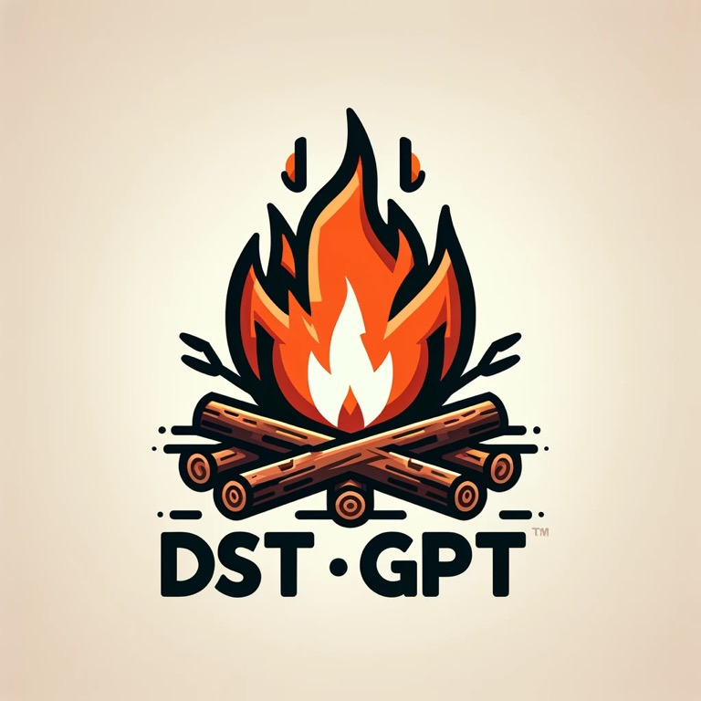
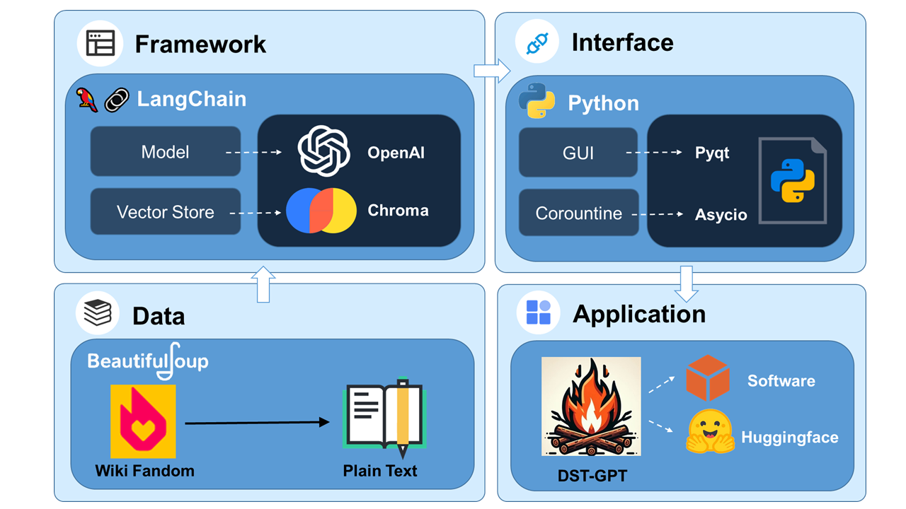
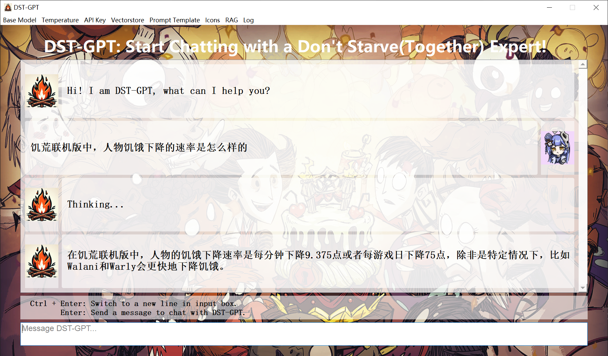
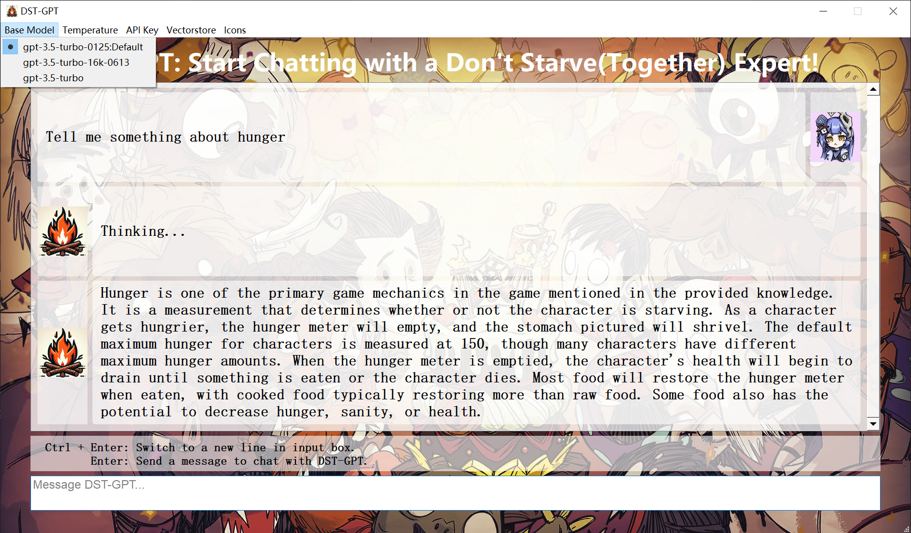
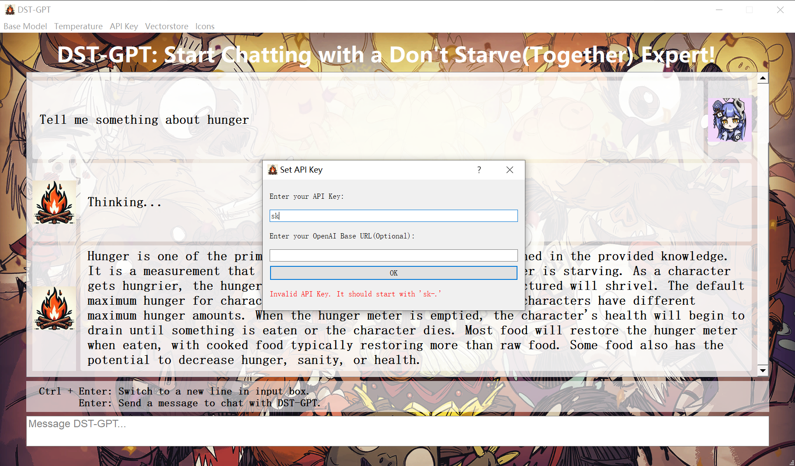
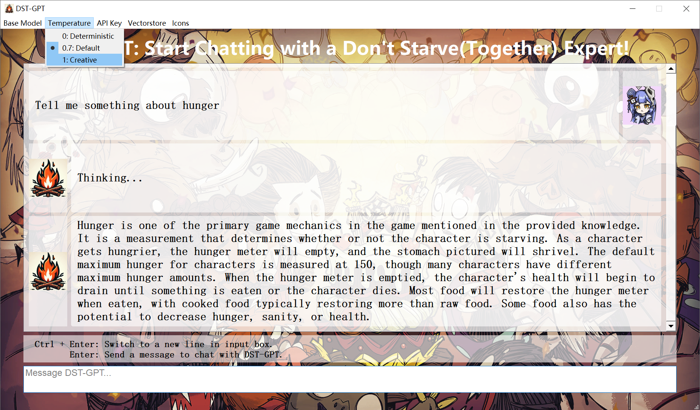
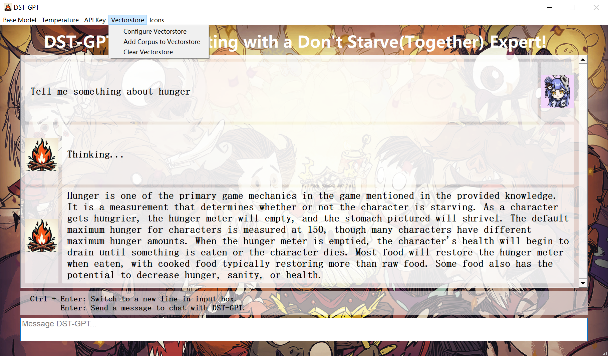
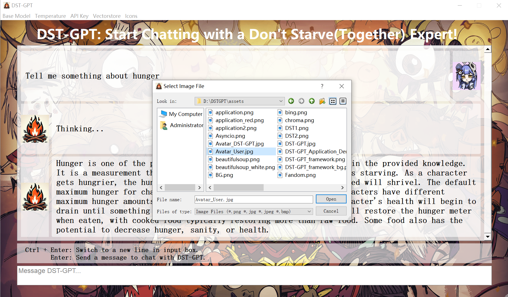

<div style="text-align:center">

<h2>🔥 DST-GPT : A Large Language Model for Don't Starve & Don't Starve Together</h2>
</div>

[](https://github.com/Bili-Sakura/DST-GPT)
[](https://www.bilibili.com/)
[](https://huggingface.co/)

## Introduction

We introduce **DST-GPT** , a chatrobot based on open-source language models, which focuses on answering questions for both Don't Starve and Don't Starve Together. Knowledge is incorporated from external databases based on Retrieval-Augmented Generation (RAG), a promising solution that enhances the accuracy and credibility of the models, particularly for knowledge-intensive tasks, and allows for continuous knowledge updates and integration of domain-specific information. Furthermore, we provide a lightweight deployment framework, allowing users to quickly deploy their own domain-specific models by replacing the corpus.
In this repository, we release the code of DST-GPT application, along with the code of data preparation.

***The following is the overview of constructing DST-GPT:***


## Quick Start

### Installation

**1. Prepare the code and the environment**

Clone our repository, create a Python environment, and activate it via the following command.

```bash
git clone https://github.com/Bili-Sakura/DST-GPT
cd DST-GPT
conda env create -f enviroment.yaml
conda activate DST-GPT
```

**2. Get access to OpenAI by purchasing api_key**

<a href='https://openai.com/pricing'> See OpenAI API Key Pricing</a>

Here, we recommend gpt-3 series base model, typically `gpt-3.5-turbo-0125`, which is capable and cost-effective,supporting a 16K context window and is optimized for dialog.
Here we list all the gpt-3 series base models, regarding to their model name, input cost and output cost.  
>Note: If you are going to use a multimodel, be it gpt-4, as your base model, you may overwrite the functions in `chat_bubble.py` to adapt the multimodel output.

| Model                  | Input Cost per 1K tokens | Output Cost per 1K tokens |
| ---------------------- | ------------------------ | ------------------------- |
| gpt-3.5-turbo-0125     | $0.0005                  | $0.0015                   |
| gpt-3.5-turbo-instruct | $0.0015                  | $0.0020                   |
| gpt-3.5-turbo-1106     | $0.0010                  | $0.0020                   |
| gpt-3.5-turbo-0613     | $0.0015                  | $0.0020                   |
| gpt-3.5-turbo-16k-0613 | $0.0030                  | $0.0040                   |
| gpt-3.5-turbo-0301     | $0.0015                  | $0.0020                   |
| gpt-3.5-turbo          | $0.0030                  | $0.0060                   |

**3. Set configurations of OpenAI**

Create a `.env` file in the root directory of DST-GPT project. Add following configurations to enable your own LLMs.

```python
"""
Note: It is also availble to use other base model instead of OpenAI's gpt series. Following these steps:
1. Add configs for your LLMs base model in .env file.
2. Adapt the LLMs interface in src/llm.py.
3. If you are using an open-sourced LLMs base model such as LLaMA-2, it is required to download pre-trained model locally. Besides, running model locally requires better CPUs/GPUs. 
"""
# Replace the value with your own OpenAI API KEY.
OPENAI_API_KEY="sk-xxxx"
# Enable the base url config if your api key is transited.
# Otherwise, set as "".
OPENAI_BASE_URL="https://baseurl.example.com"
```

**4. Launch the DST-GPT application**

>Suppose you are under home directory(DST-GPT). Also the conda environment DST-GPT is activated. 

```bash
python main.py
```

Conguratulation!  You have started the DST-GPT!  Try to chat with DST-GPT!



## Cases

|Case 1|Case 2|Case 3|
|-|-|-|
||||


- **Answer:**
    - **Question:** Q1
    - **Answer:** A1
- **Answer and Explain:**
    - **Question:** Q2
    - **Answer:** A2
- **Answer with comparison:**
    - **Question:** A3
    - **Answer:** Q3

## Evaluation

Wait for assessment...

## Data

In this repo, we share the corpus used in DST-GPT, be it `refined_data.json`:
Raw data is crawled from Wiki Fandom on DST webpages with little preprocess. Refined data is restructed from raw data.

```json
./data/refined_data.json
[{
    "text":"Don't Starve Wiki | Fandom Don't Starve Wiki Explore Main Page Discuss All Pages Community Interactive Maps Recent Blog Posts Don't Starve Features Hunger...",
    "source":"https://dontstarve.fandom.com/wiki/Don%27t_Starve_Wiki",
    "filename":"Don't Starve Wiki",
},
{   
    "text":"....",
    "source":"...",
    "filename":"...",
},...
]
```

> Note: You can replace the corpus with your own data to construct a new LLMs application in other specific field.  

```json
[{
// field:text, main content
"text":"", 
//metadata fields(optinal) describe the content, not necessary string
"metadata1":,
"metadata2":,
},...
]
```
## Auto Log

**The chatlog and meta infomation are automatically saved in `./log/xx.txt`**

```txt
# chatlog_2024020112000000.txt
## Chat Info
- Start Time: xxx
- End Time: xxx
- Message Counts: xxx
- Base Model: xxx
- Chat Tokens: xxx
- Cost: xxx
## Chat Log
DST-GPT: Message1
User: Message2
DST-GPT: Message3
```

## Configurations

### LLMs Configs

**1. Base Model**



**2. API Key**



**3. Temperature**



**4. Vectorstore**

If you already have a Chroma vectorstore with a local file like `chroma.sqlite3`, you can place it in `./database/` to construct your own LLMs application.

**Configure vectorstore**


**Add corpus to vectorstore**


**Clear vectorstore**



**5.Prompt Template**


### Icons

Set your own Icons.



<div style="display: flex; flex-direction: column; align-items: left;">
    Model Icon 1<div style="text-align:left;"></div>Model Icon 2
    <div style="text-align:left;"></div>User Icon 1
    <div style="text-align:left;"></div>User Icon 2
    <div style="text-align:left;"></div>
</div>

##  Released

DST-GPT is released in two ways: as an executable (.exe) file, providing a standalone deployment option, and also deployed on [Hugging Face](https://huggingface.co/), allowing for easy integration and usage within the Hugging Face ecosystem.

### Executable Files

### Hugging Face

[](https://huggingface.co/)

## License
DST-GPT is a chatbot intended for non-commercial use only, subject to the model License of OpenAI and the Terms of Use of the data generated by OpenAI. Please contact us if you find any potential violations. The code is released under the MIT License. The corpus data for DST-GPT is updating occasionally, if you want to subscribe the data, you can either email [bili_sakura@zju.edu.cn](mailto:bili_sakura@zju.edu.cn) or contact with me on Bilibili.

[](https://space.bilibili.com/335334097)

## Development Notes

### Wait to do list


### Bugs

**消息气泡"Thiking..."需要被移除**

### Future

**将模型以API形式封装，接入DST游戏模组**

**重载信息显示函数，支持多模态输出**

**收集格式化问答语料，进行模型性能评估**

**收集格式化问答语料，尝试监督微调**