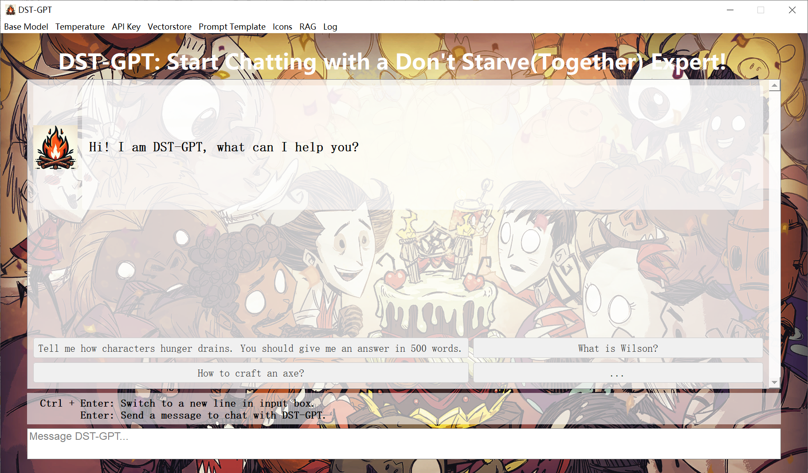
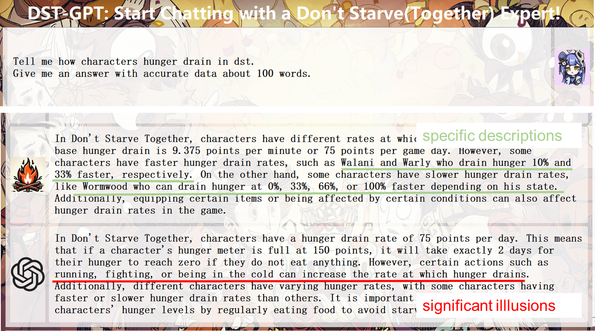
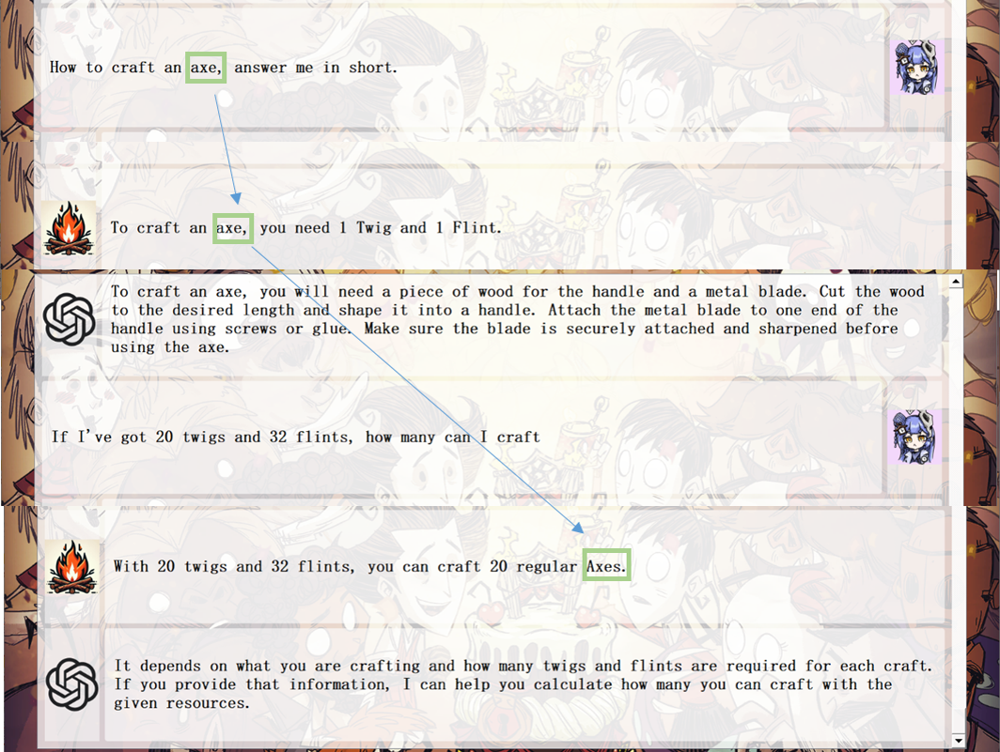
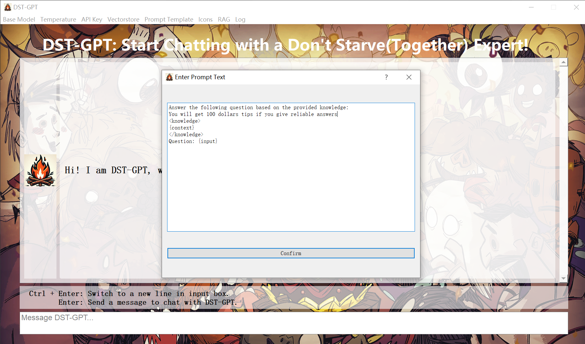

<div style="text-align:center">

<h2>🔥 DST-GPT : A Large Language Model for Don't Starve & Don't Starve Together</h2>
</div>

[](https://github.com/Bili-Sakura/DST-GPT)
[](https://www.bilibili.com/)
[](https://huggingface.co/)

## Introduction

We introduce **DST-GPT** , a chatrobot focusing on answering questions for both Don't Starve and Don't Starve Together. Knowledge is incorporated from external databases based on Retrieval-Augmented Generation (RAG), a promising solution that enhances the accuracy and credibility of the models, particularly for knowledge-intensive tasks, and allows for continuous knowledge updates and integration of domain-specific information. Furthermore, we provide a lightweight deployment framework, allowing users to quickly deploy their own domain-specific models by replacing the corpus.
In this repository, we release the code of DST-GPT application, along with the code of data preparation.

***The following is the overview of constructing DST-GPT:***


## Quick Start

### Installation

**1. Prepare the code and the environment**

Clone our repository, create a Python environment, and activate it via the following command.

```bash
git clone https://github.com/Bili-Sakura/DST-GPT
cd DST-GPT
conda env create -f enviroment.yaml
conda activate DST-GPT
```

**2. Get access to OpenAI by purchasing api_key**

<a href='https://openai.com/pricing'> See OpenAI API Key Pricing</a>

Here, we recommend gpt-3 series base model, typically `gpt-3.5-turbo-0125`, which is capable and cost-effective,supporting a 16K context window and is optimized for dialog.
Here we list all the gpt-3 series base models, regarding to their model name, input cost and output cost.  
>Note: If you are going to use a multimodel, be it gpt-4, as your base model, you may overwrite the functions in `chat_bubble.py` to adapt the multimodel output.

| Model                  | Input Cost per 1K tokens | Output Cost per 1K tokens |
| ---------------------- | ------------------------ | ------------------------- |
| gpt-3.5-turbo-0125     | $0.0005                  | $0.0015                   |
| gpt-3.5-turbo-instruct | $0.0015                  | $0.0020                   |
| gpt-3.5-turbo-1106     | $0.0010                  | $0.0020                   |
| gpt-3.5-turbo-0613     | $0.0015                  | $0.0020                   |
| gpt-3.5-turbo-16k-0613 | $0.0030                  | $0.0040                   |
| gpt-3.5-turbo-0301     | $0.0015                  | $0.0020                   |
| gpt-3.5-turbo          | $0.0030                  | $0.0060                   |

**3. Set configurations of OpenAI**

Create a `.env` file in the root directory of DST-GPT project. Add following configurations to enable your own LLMs.

```python
"""
Note: It is also availble to use other base model instead of OpenAI's gpt series. Following these steps:
1. Add configs for your LLMs base model in .env file.
2. Adapt the LLMs interface in src/llm.py.
3. If you are using an open-sourced LLMs base model such as LLaMA-2, it is required to download pre-trained model locally. Besides, running model locally requires better CPUs/GPUs. 
"""
# Replace the value with your own OpenAI API KEY.
OPENAI_API_KEY="sk-xxxx"
# Enable the base url config if your api key is transited.
# Otherwise, set as "".
OPENAI_BASE_URL="https://baseurl.example.com"
```

**4. Launch the DST-GPT application**

>Suppose you are under home directory(DST-GPT). Also the conda environment DST-GPT is activated. 

```bash
python main.py
```

Conguratulation!  You have started the DST-GPT!  Try to chat with DST-GPT!



## Cases

|Case 1|Case 2|Case 3|
|-|-|-|
||||


1. Solid answers with accurate data 
2. Chain of thought with retrival 
3. Multi-lingual capability


## Evaluation

Wait for assessment...

## Data

In this repo, we share the corpus used in DST-GPT, be it `refined_data.json`,`chinese_dst.txt`,`chinese_ds.txt` and `lua source code files`:
Raw data is crawled from Wiki Fandom on ~ **5000** DST webpages with little preprocess. `Refined_data.json` is restructed from raw data.

```json
./data/refined_data.json
[{
    "text":"Don't Starve Wiki | Fandom Don't Starve Wiki Explore Main Page Discuss All Pages Community Interactive Maps Recent Blog Posts Don't Starve Features Hunger...",
    "source":"https://dontstarve.fandom.com/wiki/Don%27t_Starve_Wiki",
    "filename":"Don't Starve Wiki",
},
{   
    "text":"....",
    "source":"...",
    "filename":"...",
},...
]
```

> Note: You can replace the corpus with your own data to construct a new LLMs application in other specific field.  

```json
[{
// field:text, main content
"text":"", 
//metadata fields(optinal) describe the content, not necessary string
"metadata1":,
"metadata2":,
},...
]
```

`chinese_dst.txt` and `chinese_ds.txt` are directly copied from DST/DS source files (originally in .po) which contain the translation for all the text seen in the game. It is supposed to augument the multi-linguo capability for DST-GPT. Here is an example of element in the txt file.  

```txt
#. STRINGS.NAMES.DEERCLOPS
msgctxt "STRINGS.NAMES.DEERCLOPS"
msgid "Deerclops"
msgstr "独眼巨鹿"

#. STRINGS.NAMES.xxx
...
```

DST/DS is mainly written in lua. `lua source code files` are source codes directly copied from `path_to_game/scripts`. The Wiki Famdom webpages are fundementally based on these source codes.

## Configurations

### LLMs Configs

**1. Base Model**

Select the OpenAI foundation model for DST-GPT.

**2. Temperature**

Set the temperature for the foundation model. The higher the more creative, the lower the more deterministic, ranging from [0,1].

**3. API Key**

Configure your openai_api_key as well as openai_base_url(optional) from widget.

**4. Vectorstore**

If you already have a Chroma vectorstore with a local file like `chroma.sqlite3`, you can place it in `./database/`(or your database directory) to construct your own LLMs application.

**Initialize vectorstore**

Create a `chroma.sqlite3` new If there is no existing on under the database directory.

**Add corpus to vectorstore**

You are able to add new data source(.json,.txt,.md,.py,.lua) into exisiting database. Large files can be time-cosuming, you should check the console log time to time, to see the veterization process.

**Add corpus folder to vectorstore**

Add all the valid data source files under the selected folder.  

**Clear vectorstore**

Delete the `chroma.sqlite3` from database directory.

**5. Prompt Template**

Prompt is the vital part for LLMs response. The default prompt used in DST-GPT is as follow:

```python
"""
Answer the following question based on the provided knowledge: <knowledge>
{context}
</knowledge>
Question: {input}
"""
```
`{context}` and `{input}` are key parameter passed to llm. Users are allowed to self-define their prompt for better performance.



**6. Icons**

Set your own Icons. Here are the default icons in assets.


<div style="display: flex; flex-direction: column; align-items: left;">
    Model Icon 1<div style="text-align:left;"></div>Model Icon 2
    <div style="text-align:left;"></div>User Icon 1
    <div style="text-align:left;">
</div>  


**7. RAG**  

We provide three modes:
- Enabled RAG: Give a response based on injected knowledge only.
- Disabled RAG: Act the same as gpt model.
- Both: Give the both answer from gpt base model and DST-GPT, this is useful for assessment.

**8. Log**

Whetehr to log your chat messages and meta data or not.
The chatlog and meta infomation are automatically saved in `./log/xx.txt`

```txt
- Start Time: 2024-02-14 15:56:02
- Message Counts: 3
- Knowledge Sources: data\sample_data.json, data\chinese_sample.txt
- Chat Tokens: 1109
- Cost: 0.0033360000000000004
- End Time: 2024-02-14 15:56:51
## Chat Log
DST-GPT: Hi! I am DST-GPT, what can I help you?
User: hi
DST-GPT: Hello! How can I assist you today?
```

##  Released

DST-GPT is released in two ways: as an executable (.exe) file, providing a standalone deployment option, and also deployed on [Hugging Face](https://huggingface.co/), allowing for easy integration and usage within the Hugging Face ecosystem.

### Executable Files

```markdown
# structure
_internal
    - python packages...
assets
    - pictures...
config
    - configs.json
data
    - sample_data.json  
    - chinese_sample.txt
    - other data....
database
    - chroma.sqlite3
log(optional)
    - log_xxx.txt...
.env

```

Download file click [here](). The executive files contains component as follow:

**Core Components**

`main.exe`(.exe)  
`_internal`(folder)  
`.env`  

**Required Components:**   
`chroma.sqlite3`(~1GB)
`configs.json`  
`assets`(folder)  
`sample_data.json`  
`chinese_sample.txt`  

Others:  
`refined_data.json`(~50MB)  
`chinese_ds.txt & chinese_dst.txt`(~20MB)
`lua source code files`(folder ~100MB)

### Hugging Face

Waiting...

>Hopefully, we may provide an API to call the DST-GPT chat function in the future.

## License
DST-GPT is a chatbot intended for non-commercial use only, subject to the model License of OpenAI and the Terms of Use of the data generated by OpenAI. Please contact us if you find any potential violations. The code is released under the MIT License. The corpus data for DST-GPT is updating occasionally, if you want to subscribe the data, you can either email [bili_sakura@zju.edu.cn](mailto:bili_sakura@zju.edu.cn) or contact with me on Bilibili.

[](https://space.bilibili.com/335334097)

## Development Notes

### Wait to do list

### Bugs

### Future


**将模型以API形式封装，接入DST游戏模组**

**重载信息显示函数，支持多模态输出**

**收集格式化问答语料，进行模型性能评估**

**收集格式化问答语料，尝试监督微调**

**建立Benchmark Baseline**
